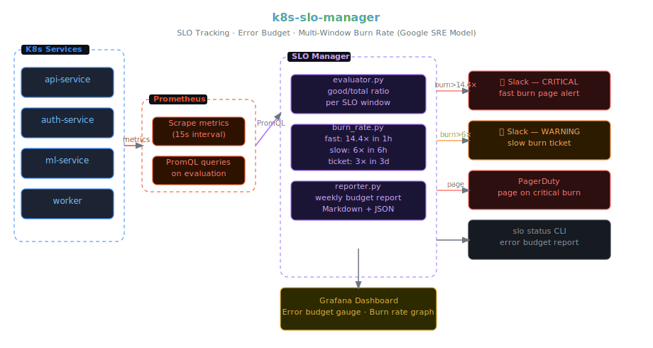

# k8s-slo-manager

> SLO tracking, error budget calculation, and burn-rate alerting for Kubernetes services — built on the Google SRE workbook model. Runs as an in-cluster daemon or standalone CLI.

[](https://github.com/ashiq-ali/k8s-slo-manager/actions)
[](LICENSE)
[](https://python.org)
[](https://prometheus.io)

---

## Architecture



> 📐 **[Edit in Excalidraw](docs/architecture.excalidraw)** — open the `.excalidraw` file at [excalidraw.com](https://excalidraw.com) to edit interactively.

```
  Kubernetes Services
  ├── api-service  ──►  Prometheus (scrape)
  ├── auth-service ──►      │
  └── ml-service   ──►      │  PromQL queries
                            ▼
                     SLO Manager
                     ├── evaluator.py   (good/total events ratio)
                     ├── burn_rate.py   (fast: 2% in 1h / slow: 5% in 6h)
                     └── reporter.py    (weekly Markdown/JSON report)
                            │
                ┌───────────┴──────────┐
                ▼                      ▼
          Grafana Dashboard      Slack / PagerDuty
          (live error budget)    (burn-rate alerts)
```

---

## Table of Contents

- [What are SLOs and why this tool](#what-are-slos)
- [Quick Start (CLI)](#quick-start-cli)
- [Deploy as In-Cluster Daemon](#deploy-as-in-cluster-daemon)
- [Defining SLOs](#defining-slos)
- [Burn Rate Alerts](#burn-rate-alerts)
- [CLI Reference](#cli-reference)
- [Grafana Dashboard](#grafana-dashboard)
- [PrometheusRule Integration](#prometheusrule-integration)
- [Configuration Reference](#configuration-reference)
- [Extending SLO Types](#extending-slo-types)
- [Troubleshooting](#troubleshooting)

---

## What are SLOs

**SLI (Service Level Indicator)** — a quantitative measure of service behaviour. Example: _ratio of HTTP requests returning 2xx_.

**SLO (Service Level Objective)** — a target for an SLI. Example: _99.9% of requests return 2xx over a 30-day window_.

**Error Budget** — how much unreliability you're allowed. A 99.9% SLO gives you 43 minutes of downtime per month. Spend it wisely.

**Burn Rate** — how fast you're spending the error budget. A burn rate of 1.0 means you'll exactly exhaust the budget by end of window. 14.4× means you'll exhaust it in 5% of the time (2 hours for a 30-day window).

This tool implements the **multi-window burn-rate alert** from [Google's SRE Workbook Chapter 5](https://sre.google/workbook/alerting-on-slos/):

| Alert | Window | Burn Rate | Budget consumed |
|-------|--------|-----------|-----------------|
| Page (fast) | 1h + 5m | ≥ 14.4× | 2% in 1h |
| Page (slow) | 6h + 30m | ≥ 6× | 5% in 6h |
| Ticket | 3d + 6h | ≥ 3× | 10% in 3d |
| Warning | 3d + 6h | ≥ 1× | on track |

---

## Quick Start (CLI)

```bash
# Install
pip install k8s-slo-manager
# or from source:
git clone https://github.com/ashiq-ali/k8s-slo-manager
cd k8s-slo-manager && pip install -e .

# Point at Prometheus
export PROMETHEUS_URL=http://localhost:9090  # or your cluster Prometheus

# Check SLO status
slo status --config examples/slos.yaml

# Generate weekly error budget report
slo report --config examples/slos.yaml --output report.md

# Continuous monitoring (daemon mode)
slo daemon --config examples/slos.yaml --interval 60
```

---

## Deploy as In-Cluster Daemon

```bash
# 1. Create ConfigMap with your SLO definitions
kubectl create configmap slo-config \
  --from-file=slos.yaml=examples/slos.yaml \
  -n monitoring

# 2. Set Slack/PagerDuty credentials
kubectl create secret generic slo-alerts \
  --from-literal=slack-webhook-url=https://hooks.slack.com/... \
  --from-literal=pagerduty-routing-key=... \
  -n monitoring

# 3. Deploy
kubectl apply -f k8s/deployment.yaml

# 4. Verify
kubectl logs -n monitoring deployment/slo-manager -f
```

The daemon evaluates all SLOs every 60 seconds, fires alerts when burn thresholds are crossed, and exposes metrics on `:8080/metrics` for Prometheus to scrape.

---

## Defining SLOs

SLOs are defined in a YAML file. See `examples/slos.yaml` for full examples.

### Availability SLO

```yaml
slos:
  - name: api-availability
    description: "API service returns 2xx for 99.9% of requests"
    service: api-service
    window_days: 30
    target: 0.999   # 99.9%

    indicator:
      type: ratio
      good_query: |
        sum(rate(http_requests_total{service="api-service",code=~"2.."}[5m]))
      total_query: |
        sum(rate(http_requests_total{service="api-service"}[5m]))
```

### Latency SLO

```yaml
  - name: api-latency-p99
    description: "99th percentile latency under 500ms for 95% of requests"
    service: api-service
    window_days: 30
    target: 0.95   # 95% of requests

    indicator:
      type: ratio
      good_query: |
        sum(rate(http_request_duration_seconds_bucket{
          service="api-service",
          le="0.5"
        }[5m]))
      total_query: |
        sum(rate(http_request_duration_seconds_count{service="api-service"}[5m]))
```

### Throughput SLO

```yaml
  - name: ml-pipeline-success
    description: "95% of ML pipeline runs complete successfully"
    service: ml-pipeline
    window_days: 7
    target: 0.95

    indicator:
      type: ratio
      good_query: |
        sum(increase(pipeline_runs_total{status="success"}[5m]))
      total_query: |
        sum(increase(pipeline_runs_total[5m]))
```

---

## Burn Rate Alerts

When a burn-rate threshold is crossed, the alerter fires:

**Slack (fast burn — page-worthy):**
```
🔴 CRITICAL: api-availability SLO burn rate alert
Service: api-service
Current burn rate: 18.3× (threshold: 14.4×)
Error budget remaining: 43% (17 days left in window)
At this rate, budget exhausted in: 1h 22m
Runbook: https://wiki.company.com/slo/api-availability
```

**Slack (slow burn — ticket):**
```
🟡 WARNING: api-latency-p99 SLO budget consumption
Service: api-service
Current burn rate: 4.1× (threshold: 3×)
Error budget remaining: 71%
Estimated exhaustion: 8 days 14 hours
```

Configure alert destinations in `examples/slos.yaml`:
```yaml
alerting:
  slack:
    webhook_url: ${SLACK_WEBHOOK_URL}
    channels:
      critical: "#platform-oncall"
      warning: "#platform-alerts"
  pagerduty:
    routing_key: ${PAGERDUTY_ROUTING_KEY}
    severity_map:
      fast_burn: critical
      slow_burn: warning
      ticket: info
```

---

## CLI Reference

```
slo status [--config PATH] [--service NAME] [--json]
  Show current SLO compliance, error budget remaining, and burn rate

slo report [--config PATH] [--window DAYS] [--output PATH] [--format md|json]
  Generate error budget report for the last N days

slo check [--config PATH] [--fail-on-breach]
  Exit 1 if any SLO is breaching (useful in CI/CD gates)

slo daemon [--config PATH] [--interval SECONDS]
  Run continuous evaluation loop

slo validate [--config PATH]
  Validate SLO definitions and test PromQL queries
```

Example `slo status` output:
```
SLO Status Report  (2024-01-15 14:32 UTC)
━━━━━━━━━━━━━━━━━━━━━━━━━━━━━━━━━━━━━━━━━━━━━━━━━━━━━━━━
SERVICE              TARGET  CURRENT  BUDGET LEFT  BURN    STATUS
api-availability     99.90%  99.94%   87.3%        0.58×   ✅ OK
api-latency-p99      95.00%  96.12%   115.2%       0.0×    ✅ OK
ml-pipeline-success  95.00%  92.11%   0.0%         ∞       🔴 BREACHING
━━━━━━━━━━━━━━━━━━━━━━━━━━━━━━━━━━━━━━━━━━━━━━━━━━━━━━━━
```

---

## Grafana Dashboard

Import `k8s/grafana-dashboard.json` into Grafana. The dashboard shows:

- **Error budget gauge** — how much budget remains per SLO (color-coded green/amber/red)
- **Burn rate graph** — time-series of burn rate with alert threshold lines
- **SLO compliance timeline** — was the target met at each point in the window?
- **Top error sources** — breakdown of what's causing good-event failures

```bash
# Import via Grafana API
curl -X POST http://grafana:3000/api/dashboards/import \
  -H "Content-Type: application/json" \
  -d @k8s/grafana-dashboard.json
```

---

## PrometheusRule Integration

`k8s/prometheusrule.yaml` creates Prometheus alerting rules for the multi-window burn rate model:

```yaml
apiVersion: monitoring.coreos.com/v1
kind: PrometheusRule
metadata:
  name: slo-burn-rate-alerts
spec:
  groups:
    - name: slo.burn_rate
      rules:
        - alert: SloBurnRateFast
          expr: |
            (
              slo:error_budget_burn_rate:1h > 14.4
              and
              slo:error_budget_burn_rate:5m > 14.4
            )
          for: 2m
          labels:
            severity: critical
          annotations:
            summary: "Fast burn rate detected for {{ $labels.slo }}"
```

Apply with:
```bash
kubectl apply -f k8s/prometheusrule.yaml
```

---

## Configuration Reference

| Environment Variable | Default | Description |
|---------------------|---------|-------------|
| `PROMETHEUS_URL` | `http://prometheus:9090` | Prometheus server URL |
| `SLO_CONFIG_PATH` | `slos.yaml` | Path to SLO definitions |
| `EVAL_INTERVAL_SECONDS` | `60` | How often to evaluate SLOs |
| `SLACK_WEBHOOK_URL` | — | Slack incoming webhook URL |
| `PAGERDUTY_ROUTING_KEY` | — | PagerDuty Events API v2 routing key |
| `REPORT_SCHEDULE` | `0 9 * * 1` | Weekly report cron (Monday 9am) |
| `LOG_LEVEL` | `INFO` | DEBUG / INFO / WARNING / ERROR |

---

## Extending SLO Types

The `evaluator.py` base class is designed for extension:

```python
from slo_manager.evaluator import SLOEvaluator

class CustomSLOEvaluator(SLOEvaluator):
    def good_events(self, window_seconds: int) -> float:
        # Query your custom data source
        return my_custom_query(window_seconds)

    def total_events(self, window_seconds: int) -> float:
        return my_total_query(window_seconds)
```

Built-in evaluator types: `ratio`, `threshold`, `windowed_mean`

---

## Troubleshooting

**`PromQL query returned no data`**

Verify the query works directly in Prometheus:
```bash
curl 'http://prometheus:9090/api/v1/query' \
  --data-urlencode 'query=sum(rate(http_requests_total[5m]))'
```

If it returns nothing, the metric may not exist or the label selectors are wrong.

**Burn rate shows `inf` or `nan`**

This means total events is zero — no traffic to the service. The burn rate is mathematically undefined. SLO Manager will show `N/A` rather than alerting.

**Error budget shows > 100%**

This is correct and expected — it means the SLI is performing _better_ than the target. A budget of 115% means you have a 15% surplus.

**Alert fired but Slack message not received**

```bash
kubectl logs -n monitoring deployment/slo-manager | grep -i slack
# Test the webhook manually:
curl -X POST $SLACK_WEBHOOK_URL \
  -H 'Content-type: application/json' \
  --data '{"text":"SLO Manager webhook test"}'
```

---

*Built to demonstrate the Google SRE workbook burn-rate model, from hands-on SLO/SLI work at Amadeus where availability SLOs governed production airline booking systems.*
